# Ghost In The Shell Credits

|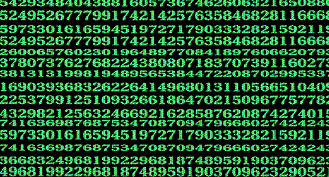|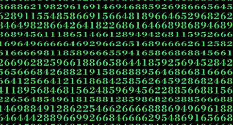|
|:----------:|:---------:|
| Original | My code |

**Note: This project is a non-commercial, fan-created work inspired by Ghost In The Shell. It is not affiliated with, endorsed by, or sponsored by the rights holders, or any of their affiliates. All trademarks and copyrighted materials belong to their respective owners. This code is intended solely for educational and artistic purposes under the principles of fair use.**

<!--TOC-->
- [Table Of Contents](#table-of-contents)
    - [Introduction](#introduction)
    - [Anatomy of the Opening Credits](#anatomy-of-the-opening-credits)
        - [12 Text Plates](#12-text-plates)
        - [Random Number Background](#random-number-background)
        - [Text Decoding Process](#text-decoding-process)
        - [Typeface](#typeface)
    - [Replicating Text Plates](#replicating-text-plates)
        - [Code Overview](#code-overview)
        - [R Code for Generating Frames](#r-code-for-generating-frames)
        - [Postprocessing with ImageMagick](#postprocessing-with-imagemagick)
    - [Instructions for Installation and Use](#instructions-for-installation-and-use)
        - [Environment Setup](#environment-setup)
            - [Installing R on Windows](#installing-r-on-windows)
            - [Typeface Installation and Setup](#typeface-installation-and-setup)
            - [Installing Ubuntu on WSL](#installing-ubuntu-on-wsl)
            - [Installing ImageMagick on Ubuntu](#installing-imagemagick-on-ubuntu)
            - [Installing ffmpeg on Ubuntu](#installing-ffmpeg-on-ubuntu)
    - [Running the Code](#running-the-code)
        - [Part 1: R Code](#part-1-r-code)
        - [Part 2: Postprocessing and Video Generation](#part-2-postprocessing-and-video-generation)
    - [Conclusion](#conclusion)
<!--TOC-->

## Introduction
To celebrate the 30th anniversary of the original [Ghost In The Shell movie from 1995](https://en.wikipedia.org/wiki/Ghost_in_the_Shell_(1995_film)), I wrote some code which recreates the opening credits for any arbitrary text. Specifically, I mean the original 1995 credits, not the updated "Version 2.0" from 2008, which are far less interesting. There's a lot going on in the credits, which I'll try to explain.  If you want to skip straight to using the scripts, full instructions for installation and use are below.

## Anatomy of the Opening Credits
The opening credits run for over 4 minutes to the tune of Kenji Kawaii's main theme. After the movie logo, they detail the lengthy, automated process of encasing the protagonist's braincase in a new prosthetic body, and end with her waking in her apartment and leaving for work. Embedded within this sequence are 12 plates of text giving the names of the topline talent involved in the production.

### 12 Text Plates 
Like every other aspect of the movie, a lot of thought and work went into each text plate. While they eventually fade into the usual white text on a black background, they begin as a grid of random digits which rapidly disappear and decode into standard English characters, all displayed on what appears to be a monochrome CRT screen and accompanied by rapid electromechanical noises. Each plate follows the same basic sequence over about 7 seconds running at 24 frames per second (fps). Although 24 fps is encoded and displayed, most of the movie is running at an effective rate of 12 fps to reduce workload and costs, with only high-speed elements like these plates animated at 24 fps. The individual steps are below along with timings and the number of frames, although there may be small variations between plates.

| 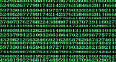 | 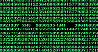 |  | 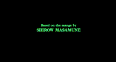 | 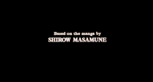 |
|:----------:|:---------:|:---------:|:---------:|:---------:|
| Random digits (24 frames) | Text decoding (19 frames) | Hold on green (5 frames) | Fade to white (24 frames) | Hold on white (96 frames) |

1. A random field of digits that changes every frame for 1 second (24 frames).
2. Text appears and is decoded with two simultaneous effects for 1 second (19 frames of text decoding, 5 frames at rest, total 24 frames).
    1. Background digits rapidly disappear until only text remains.
    2. Fragmented parts of the final text first appear as hexadecimal encodings, then two separate octal encodings, then the staggered spacing of the final English is resolved to leave every element in its final position.
3. The green monochrome text is replaced by white text over 1 second (24 frames).
4. Final white text remains in place for \~3-4 seconds (\~96 frames).

### Random Number Background
A grid of random numbers in green is displayed on a black background. Single digits are in \~15 uniformly spaced rows with \~35 columns of digits, with small offsets so that digits may appear incomplete at all four edges. While horizontal spacing is consistent, vertical is not; gaps between rows vary. Rows have one of three text sizes; the largest matching the size of the names that are displayed and the smallest matching the titles. The intermediate size is very close to the smallest. Notably, the text is not uniformly scaled and varies only in the vertical direction. Only the largest text is in the correct proportions for the typeface and the smaller sizes are vertically compressed. Extracting the text and plotting the incidence of each digit shows a flat distribution of all 10 digits (0-9). Starting at frame 32, digits are eliminated from the background with a completely blank background at frame 43. Digit removal isn't completely random, it proceeds more rapidly in rows closer to the center of the screen to clear space for the text. All digits that are removed stay that way, with the exception of digits that may be occluded by decoding text for a few frames.

### Text Decoding Process
Text can be classified as er as a title in sentence case (e.g. "Director") or a name in capitals (e.g. "MAMORU OSHII"). These two text types have slightly different rules governing the order in which they appear, but are decoded the same way. All text is fragmented into several components:

 - Titles are always split into 3 fragments of arbitrary length and appear sequentially from left to right.
 - Names are split into typically 7 fragments; 3 for the first name and 4 for the second. The first fragment of both names appear simultaneously, followed by the staggered appearance of the remaining fragments which always complete the second name on frame 43.

Text fragments can be longer, but are typically 1-3 characters, usually 2, and the decoding process follows these rules in order:

1. Hexadecimal ascii encoding of the characters. Each English character is encoded as the hexadecimal (base 16) digits representing the ascii equivalent of that character. For example, the decimal ascii code for "K" is 75, which is "4b" in hexadecimal. For multiple character fragments, the hexadecimal is concatenated into a single string (e.g. fragment "MA" =>  "4d41"). Single characters will be encoded as a 2-character hexadecimal only if they are the trailing character of an odd-numbered fragment (e.g. the third character of a 3-character fragment; "HIR" => "4849 52"). A fragment containing an isolated single letter will have the hexadecimal for whitespace ("20") prefixed to them (e.g. "I" => "2049").
2. First octal encoding of the hexadecimal characters. The 4-character hexadecimal from the previous step is converted directly to an octal (base 8) number. A zero is always prefixed to make it 6 digits long. For example, "4b41" (KA) becomes "045501". Fragments containing a single letter are treated differently depending on the text fragment that produced them. True single character fragments with their prefixed hexadecimal whitespace are treated normally (e.g. "K" => "204b" => "020113"). Odd-numbered "straggler" characters described above have a hexadecimal whitespace ("20") appended to them, are converted to 6-digit octal number and the first 3 digits are used (e.g. "HIR" => "R" => "5220" => "051040" => "051").
3. Second octal encoding of the ascii characters. Each English character is encoded as the octal digits representing the ascii equivalent of that character. For example the decimal ascii code for "K" is 75, which is "113" in octal. These are typically displayed as 3-digit blocks separated by whitespace.
4. Spaced ascii characters. The English characters are displayed with random amounts of whitespace between them.
5. Merging; the final English characters with the correct spacing are appended to any existing text.

Other considerations:

- During text decoding, the whitespace between blocks of characters may change. While the text is always centered, it jumps left and right around the screen as the total length of the text changes.
- For the first 4 frames, the encodings of the fragments of name text appear separately and background digits may be visible between them. All characters are combined into a single block from frame 5 onwards.
- These effects were produced and composited manually, by hand. This is evidenced by several factors that are highly likely to be human errors from 1995. These include i.) artifacts where decoding text incompletely occludes background digits, suggesting that the background digits were generated separately from the foreground text. ii.) Encoding errors. For example, in plate 1, "by" is incorrectly encoded in octal as "142 147" ("bg"). The letters "g" and "y" are similar to humans, but are far apart in the alphabet and ascii encoding scheme. iii.) There are also examples where encodings are duplicated or entirely mismatched from either the text they decode or decoupled from the frames they precede or follow. 

### Typeface
Teruhisa Tajima, designer of the original logo, [said in an interview](https://vuink.com/post/anvfguranzr-d-dpbz/blogs/journal/teruhisatajima) that he used the [Bodoni typeface](https://en.wikipedia.org/wiki/Bodoni):

**"I used Bodoni which is a more classic designed font."**

However, the credits themselves use a modified version; notable edits are the serifs being rounded off on "S" and a serif being added to the apex of "A". I was unable to find the exact typeface used in the credits, so instead I used the bold version of [Libre Bodoni](https://fonts.google.com/specimen/Libre+Bodoni). This is convenient, as it's open-source and the license allows me to redistribute it with this code. If you wanted to edit the typeface so it more closely matches the original, I'd be happy to include it in this repository.

## Replicating Text Plates

### Code Overview
The code has two components:
1. R code to produce the raw PNG images.
2. A postprocessing script that uses [ImageMagick](https://github.com/ImageMagick/ImageMagick) and [ffmpeg](https://ffmpeg.org/) to produce the final frames and a video file.

### R Code for Generating Frames
Some of this is repeated in the instructions for setup and use below; this section is intended to give a more complete explanation of how the code works and why. I chose R because it's the language I can write fastest in, particularly for plotting images. In my experience, R is also much less fragile than Python and doesn't require me writing additional documentation on how to install Conda and set up virtual environments. A drawback is that the code is relatively slow; generating and postprocessing all the frames for a single 7 second video typically takes 30 minutes.  However, this is not a major concern as I wasn't attempting to write a real-time system, and I'm certain this script is faster than the process was for the original animators in 1995. It's also open-source and portable, so the code should work in almost any environment. There are several hard-coded variables and arguments, particularly around the size of images. The original movie is encoded at 3840x2074 (i.e. 4k at a 1.85:1 ratio), so output is fixed at this size. There are only two files containing the R code; "sourcefunctions.R" contains all the functions, and "main_method.R" contains examples which serve as a template/demo for generating your own outputs.

The input for generating a single sequence is a list of lists. Each list defines a single row of text and contains the text, text type (i.e. title or name) and Y coordinates of the row (i.e. a number between 1 and 2074).  All text must be specified in this object. R always scales text proportionately and there are no methods to independently alter either the height or width of text, which is required for the random digits in the background. To get around this, the code creates temporary PNG images for each digit and rescales these when plotting, allowing us to change the height and keep the width the same.

A single function (generateframes()) takes three arguments; the input (list of lists), the frames that should be generated and the path to the output folder. Note that the plot preview in RStudio is _not_ representative of the final output. The two main artifacts are inappropriate text scaling of the foreground text and some background digits appearing outside the bounding box; both of these should be fine in the PNG output files. A simple summary of the process is below:

- Define inputs
- Call generateframes() to produce output
- Text is split into fragments and converted to the appropriate hexadecimal and octal encodings
- [ggplot2](https://ggplot2.tidyverse.org/) creates an empty plot with a black background of size 3840x2074, with a bounding box set to prevent plotting outside of this
- Y coordinates for the background random digits are generated based on the input row positions
- A dataframe defining the probability of digits being visible in each frame and row is created, based on the original frames
- A dataframe defining the visibilty of each background digit is created
- A random horizontal offset of up to half the width of a digit is defined
- For each frame
	- the appropriate text is created and added to the plot, and "exclusion zones" are estimated based on this text
	- visibility of background digits is updated based on the frame and row
	- background digits that are visible and outside the exclusion zones are added to the plot
	- final plot is saved to a PNG file in the raw output directory
- Final outputs are all 43 green frames from randomized digits to finished text, and a 44th frame with white text.

### Postprocessing with ImageMagick
|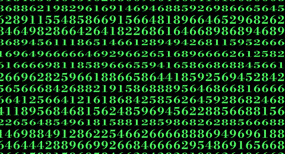||
|:----------:|:---------:|
| Raw frames | Postprocessed frames |

The raw PNG images produced by R are too clean and do not look like the intended output, so substantial postprocessing is required. Postprocessing was initially developed using Adobe Photoshop and then replicated using the open-source program ImageMagick. The script postprocesses all frames and generates any others to result in every required frame. The chromatic aberration for the white frames isn't perfect because it is uniformly applied to the image, whereas the original effect is the result of the lenses and lighting used. A better result could be obtained by calculating a depth map from the original images, but it's good enough.

| 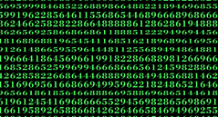 |  | 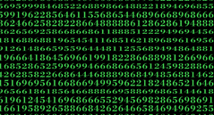 | 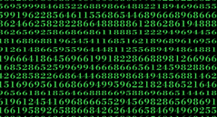 |
|:----------:|:---------:|:----------:|:---------:|
| Raw green frame | Hexagonal pattern | Merge frame with hexagons | Apply blur |
| 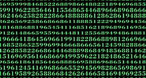 | 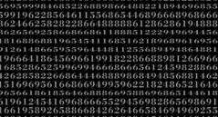 | 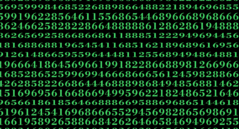 | 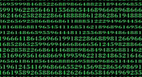 |
| Apply sharpen | Reduce brightness and hue | Recolor | Postprocessed green frame |

For green frames (raw frames 1-43):
- Create the hexagonal background pattern and thicken the lines
- Add the hexagonal pattern to the frame
- Apply a small gaussian blur
- Sharpen the image (blurring/sharpening gives rougher outlines to the text)
- Reduce brightness and convert to grayscale
- Recolor using a color lookup table derived from the original movie
- Apply a small gaussian blur

| 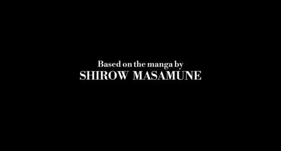 | 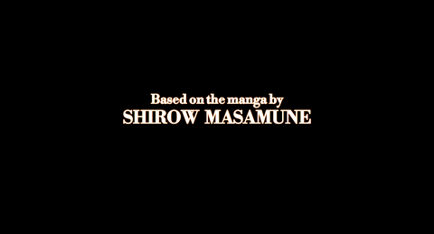 |
|:----------:|:---------:|
| Raw white frame | Postprocessed white frame |

For white frames (raw frame 44):
- Several iterations of octagonal convolution on each color channel independently (to simulate chromatic aberration)
- Apply a small gaussian blur

The script also generates the frames that transition smoothly from green to white text.

### Video Generation Using ffmpeg
Although ImageMagick can produce gifs, ffmpeg is a better choice because it's faster and can produce mp4 videos. Also, it can better reproduce the intended framerate of 24 fps because ImageMagick requires fps to be defined in 1/100ths of a second and only accepts integer values (1/24=4.1666). The default script produces a full 4k mp4 video, but below there are instructions for generating gifs and videos at different sizes.

## Instructions for Installation and Use

### Environment Setup
This pipeline was developed on Windows and Ubuntu running on WSL (Windows Subsytem for Linux). Only minor adjustments should be necessary to run it on a pure Linux system or MacOS, and it could be rewritten to run entirely on Windows using PowerShell. To replicate my environment, you will need:

#### Installing R on Windows
Install the R runtime environment: https://cran.r-project.org/
Install the RStudio IDE: https://posit.co/download/rstudio-desktop/
Install the required R packages. In Rstudio:
```
install.packages("ggplot2")
install.packages("png")
install.packages("grid")
install.packages("extrafont")
install.packages("knitr")
```
#### Typeface Installation and Setup
Install the included typeface; it must be installed for R to be able to find it and use it. This can be achieved in Windows by double-clicking on the ttf file (`LibreBodoni-VariableFont_wght.ttf`) and clicking "Install" at the top. Once installed, in RStudio:
```
## Load the extrafont package
library(extrafont)
## Register all fonts from Windows into R (only has to be done once)
font_import()
## Make fonts available to R (has to be done once per session, the code does this for you)
loadfonts()
## Check that the font "Libre Bodoni" is in the output of this function
windowsFonts()
```
#### Installing Ubuntu on WSL
There are plenty of guides for setting up Ubuntu on WSL; [this one from Ubuntu is comprehensive](https://documentation.ubuntu.com/wsl/stable/howto/install-ubuntu-wsl2/). I also recommend using [Microsoft Terminal](https://github.com/microsoft/terminal).

#### Installing ImageMagick on Ubuntu
In your Ubuntu bash terminal:
```
## Update package lists and install
sudo apt update
sudo apt install imagemagick
## Check that ImageMagick is installed (you should get the help message)
convert
```
Next, confirm that you have sufficient resources available. By default, I have seen ImageMagick6 only have 1GiB of disk space, which isn't enough. Large images like these 4k frames will be written to disk instead of memory, so you may need to increase the disk limits.
```
## List resources
convert -list resource
## Output may look something like this; note the "Disk: 1GiB" line
Resource limits:
  Width: 16KP
  Height: 16KP
  List length: unlimited
  Area: 128MP
  Memory: 256MiB
  Map: 512MiB
  Disk: 1GiB
  File: 7680
  Thread: 20
  Throttle: 0
  Time: unlimited

## The characteristic error that occurs with insufficient disk allocation will occur when ImageMagick tries to create the frames that morph between the green and white text, and will look something like:
convert-im6.q16: cache resources exhausted `plate1/pp/43.png' @ error/cache.c/OpenPixelCache/4095.

## You can fix this by editing the policy.xml file. Just change the 1GiB on line 66 to 10GiB:
## <policy domain="resource" name="disk" value="1GiB"/> # OLD
## <policy domain="resource" name="disk" value="10GiB"/> # NEW
sudo vim /etc/ImageMagick-6/policy.xml

## List resources again to check that the new limit has been applied:
convert -list resource
Resource limits:
  Width: 16KP
  Height: 16KP
  List length: unlimited
  Area: 128MP
  Memory: 256MiB
  Map: 512MiB
  Disk: 10GiB
  File: 7680
  Thread: 20
  Throttle: 0
  Time: unlimited
```

#### Installing ffmpeg on Ubuntu
In your Ubuntu bash terminal:
```
## Update package lists and install
sudo apt update
sudo apt install ffmpeg
## Check that ffmpeg is installed (you should get the help message)
ffmpeg
```
## Running the Code
The speed of the process depends on the system you're running on, but it should be 30-60 minutes and is mostly hands off.

### Part 1: R Code
As a sanity check to make sure everything works, I recommend running the example code in `mainmethod.R` that replicates the first plate of the opening credits.

If you double-click the `R_gits.Rproj` file, it should open RStudio and set the working directory to that location. Next, open `mainmethod.R`. You can just run the entire script, but the steps are:

1. Source the file which contains all the required functions. This will also load the required typeface.
`source("sourcefunctions.R")`
2. Define your input. This is a list of lists. Each sublist must contain 3 elements, with an optional 4th.
    1. The text to be displayed e.g. "Based on the manga by"
    2. The type of text to be displayed. "N" for names or "S2" for titles.
    3. The y coordinate of the text, from 1 at the bottom to 2074 at the top
    4. Optional vector of two numbers describing where to split a title. This only works for titles. e.g. c(5,19)

`## Complete input example to recreate the first plate of the opening credits
plate1=list(list("Based on the manga by","S2",1200,c(5,19)),list("SHIROW  MASAMUNE","N",1040))`

3. Run the `generateframes()` function to create the raw 44 frames. Three arguments are required:
    1. The input object, described above
    2. The frames to create (can be all 44 frames or a single frame as a test e.g. 1:44 or 44). Creating only frame 43 or 44 is useful to preview your work and make sure the text is where you want it.
    3. The name of the output directory. The output directory will be created with three subdirectories; "raw" containing the raw PNG images, "pp" for all 168 finished frames and "video" for video output.
```
## Example command to recreate the first plate of the opening credits
generateframes(plate1,1:44,outdir="plate1")
```
As each frame is generated, a message will be printed to the R console so you can track progress. Due to incorrect scaling and rendering in the RStudio plot preview window, I suggest that you open the PNG files that are created if you want to confirm the output is satisfactory.

### Part 2: Postprocessing and Video Generation
In Ubuntu, navigate to the `R_gits` directory and launch the postprocessing script (`pp.sh`). The only argument required is a path to your output directory. The example below assumes that the R_gits directory is in the user's `Documents` folder. You can edit the variables at the top of the `pp.sh` file to change the paths to ImageMagick and ffmpeg, the default assumes that they both installed correctly and are in the path. In your Ubuntu bash terminal:
```
cd /mnt/c/Users/YOURUSERNAME/Documents/R_gits
./pp.sh plate1
```
As the script progresses, a message detailing the frame being processed will be displayed. When complete, there should be 168 PNG files in the `pp` directory and an mp4 video in the `video` directory.

The default command to create a video using ffmpeg is:
```
ffmpeg -framerate 24 -start_number 1 -i /path/to/ppdir/%d.png -c:v libx264 -pix_fmt yuv420p /path/to/videodir/output.mp4
```
If you want to change to change the resolution, an example is below that emits a video at half the size of the original.
```
ffmpeg -framerate 24 -start_number 1 -i /path/to/ppdir/%d.png -c:v libx264 -pix_fmt yuv420p -vf "scale=1920:1036:force_original_aspect_ratio=decrease" halfsize.mp4
```
Alternatively, you can create an animated gif. The first example is half size and loops indefinitely, the second is full size and stops on the final frame:
```
ffmpeg -framerate 24 -start_number 1 -i /path/to/ppdir/%d.png -vf "scale=1920:1036:flags=lanczos" -loop 0 halfloop.gif
ffmpeg -framerate 24 -start_number 1 -i /path/to/ppdir/%d.png -vf "scale=3840:2074:flags=lanczos" -loop 1 fullstop.gif
```
## Conclusion
If you have an issue running the code, please open an issue on this GitHub repository. I hope my small homage to a classic finds a few appreciative users who will put it to good use, wherever and whenever that may be. As Motoko Kusanagi said at the end of the movie:
**"And where does the newborn go from here? The net is vast and infinite."**
